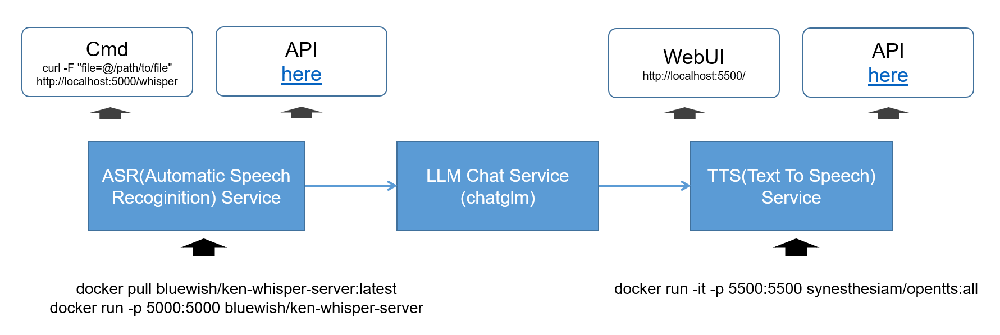

# Enterprise AI



## 1. Quick Start

### 1.1 Setup TTS (Text-To-Speech) Server

Use [OpenTTS](https://github.com/synesthesiam/opentts) setup the TTS server

```shell
docker run -it -p 5500:5500 synesthesiam/opentts:all
```

You can access via:

| Access | URL |
| ------ | --- |
| Web UI | http://localhost:5500/ |
| API | https://github.com/synesthesiam/opentts?tab=readme-ov-file#http-api-endpoints |

### 1.2 Setup ASR(Automatic Speech Recognition) Server

```shell
docker pull bluewish/ken-whisper-server:latest
docker run -p 5000:5000 bluewish/ken-whisper-server
```

Then you can use following approach to test ASR server:

```shell
curl -F "file=@/path/to/file" http://localhost:5000/whisper
```

or

```shell
python ./containers/whisper-server/whisper_client.py -f <audio file.wav> -u http://localhost:5000/whisper
```

If you want to build your own container, please

```shell
cd containers/whisper-server
docker build -t ken-whisper-server .
```

## 2. Develop

### 2.1 Build Container

```shell
./containers/build.sh
```
