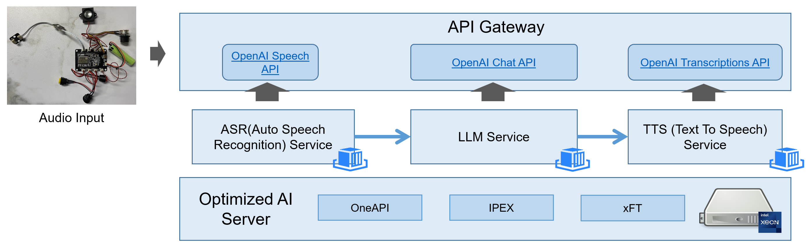

# Enterprise AI

- ChatBot Pipeline



- Meeting Summary Pipeline (TBD)

## 1. Quick Start

### 1.1 Run TTS (Text-To-Speech) Server

Use [OpenVoice](https://github.com/kenplusplus/OpenVoice) setup the TTS server


```shell
docker pull registry.cn-hangzhou.aliyuncs.com/kenplusplus/openvoice-server:latest
docker run -it -p 5500:5500 registry.cn-hangzhou.aliyuncs.com/kenplusplus/openvoice-server:latest
```

_NOTE: the Restful API is compatible with OpenAI [speech API](https://platform.openai.com/docs/api-reference/audio/createSpeech)._

Then you can use following approach to test TTS server:

```shell
curl -X 'POST' http://localhost:5500/v1/audio/speech \
    -d '{ "input": "人民是我们党执政的最大底气，是我们共和国的坚实根基，是我们强党兴国的根本所在" }' \
    -H 'accept: application/json' \
    -H 'Content-Type: application/json' --output test55.mp3
```

_NOTE: Please replace `localhost` into your hosting TTS server address._

### 1.2 Run ASR(Automatic Speech Recognition) Server


```shell
docker pull registry.cn-hangzhou.aliyuncs.com/kenplusplus/ken-whisper-server:latest
docker run -it -p 5000:5000 registry.cn-hangzhou.aliyuncs.com/kenplusplus/ken-whisper-server
```

_NOTE: the Restful API is compatible with OpenAI [Transcription API](https://platform.openai.com/docs/api-reference/audio/createTranscription)._

Then you can use following approach to test ASR server:

```shell
curl -X 'POST' -F "file=@/path/to/file" http://localhost:5000/v1/audio/transcriptions
```

_NOTE: You can replace /path/to/file to [example file](./containers/ken-whisper-server/test22.wav)._

or

```shell
python ./containers/whisper-server/whisper_client.py -f <audio file.wav> -u http://localhost:5000/whisper
```

_NOTE: Please replace `localhost` into your hosting ASR server address._

### 1.3 Run WhisperX (ASR + Diarize + Alignment) Server

```shell
docker pull bluewish/ken-whisperx-server:latest
docker run -it -p 5000:5000 bluewish/ken-whisperx-server
```

Then you can use following approach to test `whisperx` server:

```shell
curl -F "file=@/path/to/file" http://localhost:5000/whisper
```

_NOTE: You can replace /path/to/file to [example file](./containers/ken-whisperx-server/1101_515185834Y.mp3)._

The example output is at [example_output.json](./containers/ken-whisperx-server/example_output.json)

### 1.4 Run FastChat Server

#### 1.4.1 Download Models

You can download model from huggingface.

- BF16 model for AMX optimization

    ```shell
    # Llama-2-7b-chat-hf-sharded-bf16
    cd models
    git lfs install
    git clone https://huggingface.co/Trelis/Llama-2-7b-chat-hf-sharded-bf16
    ```

- INT8 model for INT8 optimization

    ```shell
    # vicuna-7b-v1.3
    cd models
    git lfs install
    git clone https://huggingface.co/lmsys/vicuna-7b-v1.3
    ```

#### 1.4.2 Getting Start to Run via Docker

##### 1.4.2.1 Run chatbot via interactive console directly

```shell
./docker-runchat.sh -m ./models/vicuna-7b-v1.3

# Run with AVX512_VNNI for INT8 model
./docker-runchat.sh -m ./models/vicuna-7b-v1.3 -i avx512_vnni

# Run with AMX for BF16 model
./docker-runchat.sh -m ./models/Llama-2-7b-chat-hf-sharded-bf16 -i amx
```

##### 1.4.2.2 Run Chatbot server and export OpenAI API

```text
        +--------------------------+      +------------------------+
        |         UI Server        |      |    OpenAI API Server   |
        |  http://10.0.0.100:9000  |      | http://10.0.0.100:8000 |
        +--------------------------+      +------------------------+
                          |                     |
                          |                     |
                         \|/                   \|/
                       +----------------------------+
                       |     Controller Server      |
                       |   http://10.0.0.100:21001  |
                       +----------------------------+
                         /|\                     /|\
                          |                       |
                          |                       |
                          |                       |
    +-------------------------+       +------------------------------------- --+
    |      Model Worker #1    |       |           Model Worker #2              |
    | http://10.0.0.100:21002 |       |      http://10.0.0.100:21003           |
    |   Model: vicuna-7b-v1.3 |       | Model: Llama-2-7b-chat-hf-sharded-bf16 |
    |    ISA: AVX512_VNNI     |       |            ISA: AMX                    |
    +-------------------------+       +----------------------------------------+
```

1. Get the host's IP address which running the containers via `ip a`, for example
   `10.0.0.100`

2. Run the controller container

   ```shell
   ./docker-runchat.sh -t controller
   ```

   By default controller will serve at `localhost:21001` or `10.0.0.100:21001` if
   the host IP address is `10.0.0.100`

3. Run local UI server

   ```shell
   # specify the controller service address, it should be same host IP address
   export CONTROLLER_SVC=10.0.0.100
   # specify the controller service port, it will be 21001 for the default one
   export CONTROLLER_PORT=21001
   ./docker-runchat.sh -t ui
   ```

   By default UI web will serve at `http://localhost:9000` or `http://10.0.0.100:9000`
   if the host IP address is `10.0.0.100`. You can open it in browser.

4. Register the model inference worker

   ```shell
   # specify the controller service address, it should be same host IP address
   export CONTROLLER_SVC=10.0.0.100

   # specify the controller service port, it will be 21001 for the default one
   export CONTROLLER_PORT=21001

   # specify the model worker address, it should be same host IP address
   export MODEL_WORKER_SVC=10.0.0.100

   # specify the model worker port, default is 21002. If register the second
   # model woker, please choose new port like 21003, 21004, 21005 etc
   export MODEL_WOKER_PORT=21002

   ./docker-runchat.sh -t model -m ./models/vicuna-7b-v1.3/ -i avx2

   ./docker-runchat.sh -t model -m ./models/vicuna-7b-v1.3/ -i avx512_vnni

   ./docker-runchat.sh -t model -m ./models/Llama-2-7b-chat-hf-sharded-bf16/ -i amx
    ```

5. Run OPENAI API server

    ```shell
    # specify the controller service address, it should be same host IP address
    export CONTROLLER_SVC=10.0.0.100

    # specify the controller service port, it will be 21001 for the default one
    export CONTROLLER_PORT=21001

    ./docker-runchat.sh -t apiserver
    ```

After running above services via docker directly, please use following approach
to communicate:

- Approach 1: Just open `http://localhost:9000` or `http://10.0.0.100:9000` in
  your web browser, and play with it
- Approach 2: Use OpenAPI API to send curl:

    ```shell
    curl http://localhost:8000/v1/completions \
    -H "Content-Type: application/json" \
    -d '{
        "model": "vicuna-7b-v1.3-avx2",
        "prompt": "Once upon a time",
        "max_tokens": 41,
        "temperature": 0.5
    }'
    ```

- Approach 3: Use OpenAPI API to write python code:
    Install

    ```shell
    pip install --upgrade openai
    ```

    Python code is as follows:

    ```python
    import openai

    openai.api_key = "EMPTY"
    openai.base_url = "http://localhost:8000/v1/"

    model = "vicuna-7b-v1.3-avx2"
    prompt = "Once upon a time"

    # create a completion
    completion = openai.completions.create(model=model, prompt=prompt, max_tokens=64)
    # print the completion
    print(prompt + completion.choices[0].text)

    # create a chat completion
    completion = openai.chat.completions.create(
    model=model,
    messages=[{"role": "user", "content": "Hello! What is your name?"}]
    )
    # print the completion
    print(completion.choices[0].message.content)

## 2. Develop

### 2.1 Build Container

Example:

```shell
# Default build script
./containers/build.sh

# Only build whisper server, without push to registry
./containers/build.sh -c ken-whisper-server -a build

# Only build TTS server, without push to registry
./containers/build.sh -c ken-opentts-server -a build
```

The complete instruction is:

```shell
usage: build.sh [OPTION]...
    -a <build|download|publish|save|all>  all is default, which not include save. Please execute save explicity if need.
    -r <registry prefix> the prefix string for registry
    -c <container name> same as directory name
    -g <tag> container image tag
    -f Clean build
```

### 2.2 Whisper

| Size | Parameters | English-only model | Multilingual model | Required VRAM | Relative Speed |
| ---- | ---------- | ------------------ | ------------------ | ------------- | -------------- |
| tiny          | 39M   | [tiny.en](https://openaipublic.azureedge.net/main/whisper/models/d3dd57d32accea0b295c96e26691aa14d8822fac7d9d27d5dc00b4ca2826dd03/tiny.en.pt) | [tiny](https://openaipublic.azureedge.net/main/whisper/models/65147644a518d12f04e32d6f3b26facc3f8dd46e5390956a9424a650c0ce22b9/tiny.pt) | ~1GB | ~32x |
| base          | 74M   | [base.en](https://openaipublic.azureedge.net/main/whisper/models/25a8566e1d0c1e2231d1c762132cd20e0f96a85d16145c3a00adf5d1ac670ead/base.en.pt) | [base](https://openaipublic.azureedge.net/main/whisper/models/ed3a0b6b1c0edf879ad9b11b1af5a0e6ab5db9205f891f668f8b0e6c6326e34e/base.pt) | ~1GB | ~16x |
| small         | 244M  | [small.en](https://openaipublic.azureedge.net/main/whisper/models/f953ad0fd29cacd07d5a9eda5624af0f6bcf2258be67c92b79389873d91e0872/small.en.pt) | [small](https://openaipublic.azureedge.net/main/whisper/models/9ecf779972d90ba49c06d968637d720dd632c55bbf19d441fb42bf17a411e794/small.pt) | ~2GB | ~6x |
| medium        | 769M  | [medium.en](https://openaipublic.azureedge.net/main/whisper/models/d7440d1dc186f76616474e0ff0b3b6b879abc9d1a4926b7adfa41db2d497ab4f/medium.en.pt) | [medium](https://openaipublic.azureedge.net/main/whisper/models/345ae4da62f9b3d59415adc60127b97c714f32e89e936602e85993674d08dcb1/medium.pt) | ~5GB | ~2x |
| large-v1      | 1550M | | [large-v1](https://openaipublic.azureedge.net/main/whisper/models/e4b87e7e0bf463eb8e6956e646f1e277e901512310def2c24bf0e11bd3c28e9a/large.pt) | ~10GB | 1x |
| large-v2      |  |  | [large-v2](https://openaipublic.azureedge.net/main/whisper/models/81f7c96c852ee8fc832187b0132e569d6c3065a3252ed18e56effd0b6a73e524/large-v2.pt) |  |  |
| large-v3      |  | | [large-v3](https://openaipublic.azureedge.net/main/whisper/models/e5b1a55b89c1367dacf97e3e19bfd829a01529dbfdeefa8caeb59b3f1b81dadb/large-v3.pt) |  |  |

_NOTE: By default, using the small model at [here](./containers/ken-whisper-server/app.py)_
